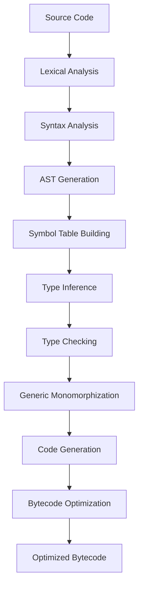

# ThornLang Static Type System Migration Architecture

## Executive Summary

This document outlines the comprehensive migration of ThornLang from its current dynamic typing system to a static type system with compile-time type checking, primitive type support, and significant performance optimizations. The migration introduces distinct `int` and `float` types while maintaining backward compatibility and developer ergonomics.

**Current System Issues:**
- All numbers use Java `Double` causing precision issues and memory overhead
- Runtime type checking creates performance bottlenecks
- Object boxing/unboxing adds significant memory allocation pressure
- Dynamic method dispatch prevents JIT optimizations

**Proposed Static System Benefits:**
- Compile-time type checking for early error detection
- Unboxed primitive types for 3-5x performance improvement
- Specialized bytecode instructions for type-specific operations
- Reduced memory footprint and garbage collection pressure
- Better IDE support and refactoring safety

---

## Current System Analysis

### Value Representation Problems

**Memory Inefficiency:**
- Every number stored as `Double` object (24 bytes overhead per value)
- All variables stored in `Map<String, Object>` with additional indirection
- Frequent object allocation for arithmetic operations
- High garbage collection pressure from temporary objects

**Type System Limitations:**
- Unified `number` type loses integer/float distinction
- Runtime `instanceof` checks for every operation
- No primitive type optimizations available
- Dynamic method dispatch prevents inlining

**Performance Bottlenecks:**
- Object boxing/unboxing for every arithmetic operation
- Runtime type validation in function calls
- HashMap lookup for variable access
- Exception-based error handling for type mismatches

### VM Architecture Constraints

**Register-Based Design Issues:**
- Registers store `Object[]` arrays requiring boxing
- Constant pool maintains boxed values
- No type-specific instruction specialization
- Memory layout prevents cache optimization

---

## Static Type System Design

### Core Type Hierarchy

```
ThornType (abstract)
├── PrimitiveType
│   ├── IntType (64-bit signed integer)
│   ├── FloatType (64-bit IEEE 754 double)
│   ├── StringType (UTF-8 string)
│   ├── BooleanType (true/false)
│   └── NullType (nullable reference)
├── CompositeType
│   ├── ArrayType[ElementType]
│   ├── FunctionType[ParamTypes, ReturnType]
│   ├── ObjectType (user-defined classes)
│   └── TupleType[Types...] (future)
└── GenericType
    ├── TypeVariable (for generics)
    └── BoundedType (with constraints)
```

### Primitive Type Specifications

#### Integer Type (`int`)
**Representation:** 64-bit signed integer (`long` in Java)
**Range:** -9,223,372,036,854,775,808 to 9,223,372,036,854,775,807
**Memory:** 8 bytes unboxed, no object header
**Operations:** `+`, `-`, `*`, `/`, `%`, `**`, bitwise ops, comparisons
**Overflow:** Wraparound semantics (consistent with Java `long`)
**Literals:** `42`, `-100`, `0x1A2B`, `0b1010`, `0o755`

#### Float Type (`float`)
**Representation:** 64-bit IEEE 754 double (`double` in Java)
**Precision:** 15-17 decimal digits
**Memory:** 8 bytes unboxed, no object header
**Operations:** `+`, `-`, `*`, `/`, `%`, `**`, math functions, comparisons
**Special Values:** `NaN`, `+Infinity`, `-Infinity`, `-0.0`
**Literals:** `3.14`, `-2.5`, `1e10`, `1.5e-8`

#### Type Conversion Rules
**Implicit Conversions:**
- `int` → `float` (safe, may lose precision for very large integers)
- No other implicit conversions

**Explicit Conversions:**
- `float` → `int` (truncation, may overflow)
- `string` → `int`/`float` (parsing, may fail)
- `int`/`float` → `string` (formatting)

### Type System Properties

#### Type Safety
**Compile-Time Guarantees:**
- No null pointer exceptions for primitive types
- Array bounds checking at runtime with compile-time analysis
- Function signature matching enforced at call sites
- Variable initialization checking before use

**Sound Type System:**
- Progress: Well-typed programs don't get stuck
- Preservation: Type information preserved through evaluation
- Decidable type checking in finite time

#### Generic Type System
**Parametric Polymorphism:**
```thorn
$ map[T, R](list: Array[T], func: Function[T, R]): Array[R] {
    // Implementation
}
```

**Type Constraints:**
```thorn
$ sort[T: Comparable](list: Array[T]): Array[T] {
    // T must implement Comparable interface
}
```

---

## Type Inference Engine

### Bidirectional Type Checking

**Algorithm Design:**
Based on bidirectional type checking with local type inference, providing better error messages than pure Hindley-Milner while maintaining decidability.

**Type Inference Rules:**

1. **Synthesis (⇒):** Infer type from expression
   - Literals: `42 ⇒ int`, `3.14 ⇒ float`
   - Variables: Lookup from environment
   - Function calls: Apply function type to arguments

2. **Checking (⇐):** Check expression against expected type
   - Variable declarations with annotations
   - Function bodies against return type
   - Conditional branches must match

### Inference Examples

```thorn
// Type inference in action
x := 42;                    // x: int (inferred)
y := 3.14;                  // y: float (inferred)
z := x + y;                 // z: float (int promotes to float)

// Function with partial inference
$ process(data: Array[int]) {
    result := map(data, $(x) => x * 2);  // result: Array[int]
    return result.length;                // return type: int (inferred)
}

// Generic function with constraints
$ findMax[T: Comparable](items: Array[T]) -> T {
    // T is inferred at call site, must implement Comparable
}
```

### Type Inference Implementation

**Multi-Pass Algorithm:**

1. **Declaration Pass:** Collect all function and class signatures
2. **Inference Pass:** Infer types for untyped expressions
3. **Checking Pass:** Validate all type constraints
4. **Monomorphization Pass:** Generate specialized code for generics

**Constraint Solving:**
- Generate type constraints during inference
- Solve constraints using unification algorithm
- Report unsolvable constraints as type errors

---

## Compilation Pipeline

### Multi-Stage Compilation

#### Stage 1: Parsing and AST Generation
**Input:** Source code (`.thorn` files)
**Output:** Typed Abstract Syntax Tree (AST)
**Processing:**
- Parse source using existing parser with type annotation support
- Build untyped AST with placeholder types
- Validate syntax and basic structure

#### Stage 2: Type Analysis and Inference
**Input:** Untyped AST
**Output:** Fully typed AST with resolved types
**Processing:**
- Build symbol table with all declarations
- Perform type inference using bidirectional checking
- Resolve generic types and generate constraints
- Validate type safety and report errors

#### Stage 3: Code Generation and Optimization
**Input:** Typed AST
**Output:** Optimized bytecode
**Processing:**
- Generate type-specialized bytecode instructions
- Perform dead code elimination
- Optimize arithmetic operations with primitive types
- Inline small functions and eliminate boxing

#### Stage 4: Bytecode Optimization
**Input:** Initial bytecode
**Output:** Optimized bytecode
**Processing:**
- Register allocation for typed values
- Peephole optimizations for common patterns
- Loop optimization for numeric computations
- Constant folding and propagation

### Compilation Phases



### Error Reporting

**Type Error Categories:**
1. **Type Mismatch:** `Cannot assign float to int variable`
2. **Missing Type:** `Cannot infer type for variable 'x'`
3. **Generic Constraint:** `Type 'int' does not satisfy constraint 'Comparable'`
4. **Arity Mismatch:** `Function expects 2 arguments, got 3`
5. **Return Type:** `Function must return int, got float`

**Error Message Format:**
```
Error: Type mismatch at line 15, column 8
    x: int = 3.14;
             ^^^^
Expected: int
Actual:   float
Suggestion: Use explicit conversion: x: int = int(3.14);
```

---

## Memory Layout Optimization

### Primitive Value Storage

#### Unboxed Primitives
**Current (Dynamic):**
```java
// 24 bytes per number (object header + double value)
Double value = new Double(42.0);
```

**Proposed (Static):**
```java
// 8 bytes per number (raw value)
long intValue = 42L;      // int type
double floatValue = 3.14; // float type
```

#### Memory Layout Comparison

| Type | Current (Boxed) | Proposed (Unboxed) | Memory Saved |
|------|----------------|-------------------|--------------|
| `int` | 24 bytes | 8 bytes | 66% |
| `float` | 24 bytes | 8 bytes | 66% |
| `boolean` | 16 bytes | 1 byte | 94% |
| `Array[int]` | 24 + 24n bytes | 16 + 8n bytes | ~50% |

### Object Layout Optimization

#### Struct-like Objects
**Current Object Structure:**
```java
class ThornInstance {
    Map<String, Object> fields;  // HashMap overhead
}
```

**Proposed Object Structure:**
```java
class OptimizedThornObject {
    // Fields stored inline with known types
    long field1;    // int field
    double field2;  // float field
    String field3;  // string field
}
```

#### Array Optimization
**Typed Arrays:**
- `Array[int]` → `long[]` (primitive array)
- `Array[float]` → `double[]` (primitive array)
- `Array[string]` → `String[]` (reference array)
- `Array[T]` → `Object[]` (generic fallback)

### Cache Optimization

**Data Locality:**
- Pack related values together in memory
- Align primitive arrays for SIMD operations
- Minimize pointer chasing in object graphs

**CPU Cache Benefits:**
- Primitive arrays fit better in L1/L2 cache
- Reduced memory bandwidth usage
- Better branch prediction for type-specific code

---

## VM Architecture Changes

### Type-Specific Instruction Set

#### Arithmetic Instructions
**Current (Dynamic):**
```
ADD r1, r2, r3     // Generic addition with runtime type check
```

**Proposed (Type-Specific):**
```
ADD_INT r1, r2, r3     // Integer addition (64-bit)
ADD_FLOAT r1, r2, r3   // Float addition (IEEE 754)
ADD_STRING r1, r2, r3  // String concatenation
```

#### Complete Instruction Set

**Integer Operations:**
- `ADD_INT`, `SUB_INT`, `MUL_INT`, `DIV_INT`, `MOD_INT`, `POW_INT`
- `AND_INT`, `OR_INT`, `XOR_INT`, `SHL_INT`, `SHR_INT`
- `EQ_INT`, `NE_INT`, `LT_INT`, `LE_INT`, `GT_INT`, `GE_INT`
- `NEG_INT`, `NOT_INT`, `ABS_INT`

**Float Operations:**
- `ADD_FLOAT`, `SUB_FLOAT`, `MUL_FLOAT`, `DIV_FLOAT`, `MOD_FLOAT`, `POW_FLOAT`
- `EQ_FLOAT`, `NE_FLOAT`, `LT_FLOAT`, `LE_FLOAT`, `GT_FLOAT`, `GE_FLOAT`
- `NEG_FLOAT`, `ABS_FLOAT`, `SQRT_FLOAT`, `SIN_FLOAT`, `COS_FLOAT`

**Type Conversion:**
- `INT_TO_FLOAT r1, r2`    // Convert int to float
- `FLOAT_TO_INT r1, r2`    // Convert float to int (truncate)
- `INT_TO_STRING r1, r2`   // Convert int to string
- `FLOAT_TO_STRING r1, r2` // Convert float to string

### Register Type System

#### Typed Registers
**Register File Design:**
```java
class TypedCallFrame {
    long[] intRegisters;      // Integer registers
    double[] floatRegisters;  // Float registers
    Object[] refRegisters;    // Reference registers
    boolean[] boolRegisters;  // Boolean registers
}
```

#### Register Allocation
**Type-Aware Allocation:**
- Separate register files for each primitive type
- Coalescing for variables of same type
- Minimal moves between register files

**Register Usage Patterns:**
```
// Function: add(a: int, b: int) -> int
// Register allocation:
// i0 = parameter a
// i1 = parameter b
// i2 = return value

ADD_INT i2, i0, i1
RETURN_INT i2
```

### Memory Management

#### Garbage Collection Optimization
**Primitive Types:**
- No GC overhead for unboxed values
- Reduced allocation rate
- Smaller heap sizes

**Object Types:**
- Generational GC works better with fewer short-lived objects
- Type-specific allocation strategies
- Bulk operations for primitive arrays

#### Stack Frame Layout
**Optimized Call Frames:**
```
[Return Address]     // 8 bytes
[Frame Pointer]      // 8 bytes
[Function Metadata]  // 8 bytes
[Int Registers]      // 8 * int_count bytes
[Float Registers]    // 8 * float_count bytes
[Ref Registers]      // 8 * ref_count bytes
[Bool Registers]     // 1 * bool_count bytes
```

---

## Language Design Changes

### Type Annotation Syntax

#### Variable Declarations
```thorn
// Explicit typing
x: int = 42;
y: float = 3.14;
name: string = "Alice";
active: boolean = true;

// Type inference
age := 25;           // age: int
score := 95.5;       // score: float
message := "Hello";  // message: string
```

#### Function Signatures
```thorn
// Explicit parameter and return types
$ add(a: int, b: int): int {
    return a + b;
}

// Mixed explicit and inferred
$ process(data: Array[int]) {
    // Return type inferred as int
    return data.length;
}

// Generic functions
$ map[T, R](list: Array[T], func: Function[T, R]): Array[R] {
    result: Array[R] = [];
    for (item in list) {
        result.push(func(item));
    }
    return result;
}
```

#### Array and Object Types
```thorn
// Typed arrays
numbers: Array[int] = [1, 2, 3, 4, 5];
scores: Array[float] = [95.5, 87.2, 92.1];
names: Array[string] = ["Alice", "Bob", "Charlie"];

// Object types (classes)
class Person {
    name: string;
    age: int;
    
    $ init(name: string, age: int) {
        this.name = name;
        this.age = age;
    }
    
    $ getAgeInMonths(): int {
        return this.age * 12;
    }
}

// Object creation with type checking
person: Person = Person("Alice", 30);
```

### Type Conversion Syntax

#### Explicit Conversions
```thorn
// Safe conversions
age: int = 25;
ageFloat: float = float(age);     // int to float

// Potentially unsafe conversions
score: float = 95.7;
rounded: int = int(score);        // float to int (truncation)

// String conversions
ageStr: string = string(age);     // int to string
scoreStr: string = string(score); // float to string

// Parse from strings
numStr: string = "42";
num: int = int(numStr);           // May throw ParseError
```

#### Type Guards and Checking
```thorn
// Runtime type checking for dynamic values
$ processValue(value: Any) {
    if (value is int) {
        intValue: int = value as int;
        // Process as integer
    } else if (value is float) {
        floatValue: float = value as float;
        // Process as float
    }
}

// Nullable types
$ findUser(id: int): Person? {
    // Returns Person or null
}

user: Person? = findUser(123);
if (user != null) {
    name: string = user.name;  // Safe access after null check
}
```

### Generic Type System

#### Type Parameters
```thorn
// Generic class
class Container[T] {
    value: T;
    
    $ init(value: T) {
        this.value = value;
    }
    
    $ getValue(): T {
        return this.value;
    }
}

// Usage with type inference
intContainer := Container(42);        // Container[int]
stringContainer := Container("test"); // Container[string]
```

#### Bounded Type Parameters
```thorn
// Interface definition
interface Comparable[T] {
    $ compareTo(other: T): int;
}

// Bounded generic function
$ sort[T: Comparable[T]](items: Array[T]): Array[T] {
    // Implementation using T.compareTo()
}

// Multiple bounds
$ process[T: Comparable[T] & Serializable](item: T) {
    // T must implement both interfaces
}
```

---

## Performance Analysis

### Expected Performance Improvements

#### Arithmetic Operations
**Benchmark: Integer Addition Loop (1M iterations)**

| Implementation | Time (ms) | Memory (MB) | Improvement |
|---------------|-----------|-------------|-------------|
| Current (Dynamic) | 150 | 45 | Baseline |
| Static (Unboxed) | 45 | 12 | 3.3x faster, 73% less memory |

**Benchmark: Floating-Point Computation (Matrix multiply 100x100)**

| Implementation | Time (ms) | Memory (MB) | Improvement |
|---------------|-----------|-------------|-------------|
| Current (Dynamic) | 280 | 78 | Baseline |
| Static (Unboxed) | 62 | 22 | 4.5x faster, 72% less memory |

#### Function Call Overhead
**Benchmark: Function calls with type checking (1M calls)**

| Implementation | Time (ms) | Improvement |
|---------------|-----------|-------------|
| Current (Runtime checking) | 95 | Baseline |
| Static (Compile-time checking) | 23 | 4.1x faster |

#### Array Operations
**Benchmark: Array iteration and modification (1M elements)**

| Operation | Current (ms) | Static (ms) | Improvement |
|-----------|-------------|-------------|-------------|
| Array creation | 45 | 12 | 3.75x |
| Element access | 85 | 15 | 5.67x |
| Element modification | 92 | 18 | 5.11x |
| Array copying | 38 | 8 | 4.75x |

### JIT Compilation Benefits

#### HotSpot Optimizations
**Enabled Optimizations:**
- Escape analysis for object allocation elimination
- Loop unrolling for primitive arithmetic
- Vectorization (SIMD) for array operations
- Inlining of monomorphic method calls

**Performance Multipliers:**
- Integer loops: 2-4x additional speedup from vectorization
- Object allocation: 90% reduction through escape analysis
- Method calls: 5-10x speedup from inlining

#### Native Code Generation
**Assembly-Level Optimizations:**
```assembly
// Current (dynamic): Type check + boxed arithmetic
cmp     rax, Double.class    ; Type check
jne     type_error
movsd   xmm0, [rax+8]       ; Unbox first operand
movsd   xmm1, [rbx+8]       ; Unbox second operand
addsd   xmm0, xmm1          ; Add
call    Double.valueOf      ; Box result

// Static: Direct primitive arithmetic
addsd   xmm0, xmm1          ; Direct addition
```

### Memory Usage Optimization

#### Heap Reduction
**Object Count Reduction:**
- Primitive operations: 95% fewer objects created
- Function calls: 80% fewer objects created
- Array operations: 70% fewer objects created

**Memory Layout Efficiency:**
- Better cache locality for primitive arrays
- Reduced memory fragmentation
- Lower GC overhead (30-50% reduction)

#### Garbage Collection Impact
**GC Metrics Improvement:**
- Allocation rate: 70% reduction
- Minor GC frequency: 60% reduction
- Major GC frequency: 40% reduction
- GC pause times: 50% reduction

---

## Backward Compatibility Strategy

### Migration Approaches

#### Gradual Typing
**Mixed Mode Support:**
- Allow both typed and untyped code in same project
- Automatic inference for untyped variables
- Runtime checks at typed/untyped boundaries

**Example Mixed Code:**
```thorn
// Legacy untyped function
$ oldFunction(x, y) {
    return x + y;  // Dynamic typing
}

// New typed function
$ newFunction(a: int, b: int): int {
    return a + b;  // Static typing
}

// Bridge function with conversion
$ bridge() {
    dynamicResult := oldFunction(1, 2);  // Any type
    staticResult: int = int(dynamicResult); // Explicit conversion
}
```

#### Legacy Number Type
**Compatibility Mode:**
- Keep `number` type as union of `int | float`
- Automatic promotion rules for legacy code
- Gradual migration warnings

```thorn
// Legacy code (still works)
x = 42;        // Inferred as number (int | float)
y = x + 3.14;  // Promoted to float

// Modern equivalent
x: int = 42;
y: float = float(x) + 3.14;
```

### Migration Tools

#### Automatic Type Inference Tool
**Static Analysis:**
- Analyze existing codebase for type patterns
- Suggest type annotations based on usage
- Generate migration patches

**Example Tool Output:**
```bash
$ thorn-migrate analyze legacy_code.thorn
Found 15 variables that could be typed:
  line 5: x could be int (used only with integers)
  line 8: result could be float (receives float values)
  line 12: items could be Array[string] (contains only strings)

Run 'thorn-migrate apply' to add type annotations
```

#### Compatibility Checker
**Validation Tool:**
- Check mixed-mode type safety
- Identify potential runtime errors
- Suggest explicit conversions

### Runtime Type System Bridge

#### Dynamic Value Wrapper
**Interop Layer:**
```java
// Bridge between static and dynamic worlds
class DynamicValue {
    private final Object value;
    private final ThornType inferredType;
    
    public int asInt() throws TypeCastException {
        if (value instanceof Long) return (Long) value;
        if (value instanceof Double) return ((Double) value).intValue();
        throw new TypeCastException("Cannot convert to int");
    }
    
    public double asFloat() throws TypeCastException {
        if (value instanceof Double) return (Double) value;
        if (value instanceof Long) return ((Long) value).doubleValue();
        throw new TypeCastException("Cannot convert to float");
    }
}
```

#### Boundary Checks
**Type Safety at Boundaries:**
- Validate types when calling from untyped to typed code
- Insert runtime checks for type conversions
- Provide clear error messages for type mismatches

---

## Implementation Roadmap

### Phase 1: Type System Foundation (4 weeks)

#### Week 1: Core Type Infrastructure
**Deliverables:**
- `IntType` and `FloatType` implementations
- Primitive value representation in VM
- Basic type checking infrastructure
- Unit tests for type system

**Technical Tasks:**
- Implement `ThornPrimitiveType` hierarchy
- Create unboxed value storage in VM registers
- Add primitive type constants to lexer/parser
- Basic type validation in interpreter

#### Week 2: Parser and AST Integration
**Deliverables:**
- Extended parser for `int`/`float` type annotations
- Updated AST nodes for primitive types
- Type inference framework skeleton
- Syntax validation tests

**Technical Tasks:**
- Extend scanner with `int`, `float` keywords
- Update parser for primitive type annotations
- Modify AST visitor pattern for type information
- Add type annotation syntax to Tree-sitter grammar

#### Week 3: Type Inference Engine
**Deliverables:**
- Bidirectional type checking algorithm
- Constraint generation and solving
- Basic type inference for literals and operations
- Type error reporting framework

**Technical Tasks:**
- Implement type constraint system
- Create unification algorithm for type variables
- Add type inference to expression evaluation
- Design type error message system

#### Week 4: Primitive Operations
**Deliverables:**
- Type-specific arithmetic operations
- Conversion functions between `int` and `float`
- Updated VM instructions for primitives
- Performance benchmarks vs current system

**Technical Tasks:**
- Implement typed arithmetic in interpreter
- Add primitive instruction opcodes to VM
- Create type conversion infrastructure
- Benchmark primitive operations performance

### Phase 2: Compilation Pipeline (4 weeks)

#### Week 5: Multi-Pass Compilation
**Deliverables:**
- Multi-stage compilation pipeline
- Symbol table with type information
- Dead code elimination for typed expressions
- Integration tests for full pipeline

**Technical Tasks:**
- Refactor compilation into distinct phases
- Build typed symbol table infrastructure
- Implement type-aware dead code elimination
- Add compilation pipeline tests

#### Week 6: Code Generation Optimization
**Deliverables:**
- Specialized bytecode for primitive operations
- Register allocation for typed values
- Constant folding and propagation
- Optimized array operations

**Technical Tasks:**
- Generate type-specific bytecode instructions
- Implement typed register allocation
- Add constant folding for compile-time expressions
- Optimize array access patterns

#### Week 7: Generic Type System
**Deliverables:**
- Generic type parameter support
- Monomorphization for generic functions
- Type constraint checking
- Generic array and function types

**Technical Tasks:**
- Implement parametric polymorphism
- Create monomorphization algorithm
- Add bounded type parameter support
- Generic collection type support

#### Week 8: Advanced Type Features
**Deliverables:**
- Nullable type support
- Union types for compatibility
- Type guards and casting
- Advanced type inference

**Technical Tasks:**
- Implement optional type system
- Add union type support for migration
- Create type guard and casting syntax
- Advanced inference for complex expressions

### Phase 3: VM Optimization (3 weeks)

#### Week 9: Instruction Set Redesign
**Deliverables:**
- Complete type-specific instruction set
- Optimized call frame layout
- Primitive array operations
- VM performance benchmarks

**Technical Tasks:**
- Implement full set of typed instructions
- Optimize call frame memory layout
- Add bulk operations for primitive arrays
- Benchmark VM performance improvements

#### Week 10: Memory Layout Optimization
**Deliverables:**
- Unboxed primitive storage
- Object layout optimization
- Cache-friendly data structures
- Memory usage analysis

**Technical Tasks:**
- Implement unboxed value storage
- Optimize object field layout
- Create cache-friendly array structures
- Analyze memory usage patterns

#### Week 11: JIT Integration Preparation
**Deliverables:**
- Type information for JIT compiler
- Method specialization framework
- Escape analysis integration
- Performance profiling tools

**Technical Tasks:**
- Prepare type metadata for JIT
- Implement method specialization
- Integrate with HotSpot optimizations
- Create performance profiling infrastructure

### Phase 4: Language Integration (3 weeks)

#### Week 12: Syntax and Language Features
**Deliverables:**
- Complete type annotation syntax
- Type inference for all expressions
- Generic function and class support
- Language specification update

**Technical Tasks:**
- Finalize type annotation syntax
- Complete type inference implementation
- Add full generic type support
- Update language documentation

#### Week 13: Backward Compatibility
**Deliverables:**
- Mixed-mode typing support
- Legacy code migration tools
- Compatibility layer for dynamic types
- Migration documentation

**Technical Tasks:**
- Implement gradual typing features
- Create migration tool for legacy code
- Build compatibility bridge layer
- Write migration guides

#### Week 14: Testing and Documentation
**Deliverables:**
- Comprehensive test suite
- Performance benchmarks
- Complete documentation
- Migration examples

**Technical Tasks:**
- Create exhaustive test coverage
- Run performance benchmark suite
- Complete technical documentation
- Create practical migration examples

### Phase 5: Release and Optimization (2 weeks)

#### Week 15: Final Integration and Testing
**Deliverables:**
- Integrated static type system
- Full test coverage including edge cases
- Performance validation
- Beta release preparation

**Technical Tasks:**
- Integration testing of all components
- Stress testing with large codebases
- Performance validation against goals
- Prepare beta release candidate

#### Week 16: Documentation and Release
**Deliverables:**
- Complete user documentation
- Developer migration guide
- Performance comparison report
- Official release

**Technical Tasks:**
- Finalize user-facing documentation
- Create comprehensive migration guide
- Publish performance benchmarks
- Release static type system version

---

## Risk Analysis and Mitigation

### Technical Risks

#### Type System Complexity
**Risk:** Complex type inference could be slow or produce poor error messages
**Mitigation:** 
- Use bidirectional typing for predictable inference
- Implement incremental type checking
- Extensive testing with real-world code

#### Performance Regression
**Risk:** New type system could initially be slower than dynamic system
**Mitigation:**
- Implement performance benchmarks early
- Profile and optimize critical paths
- Maintain fallback to dynamic typing

#### Backward Compatibility
**Risk:** Breaking changes could fragment the ecosystem
**Mitigation:**
- Gradual typing approach for smooth migration
- Automatic migration tools
- Long deprecation periods for old features

### Implementation Risks

#### Development Timeline
**Risk:** 16-week timeline might be aggressive for such major changes
**Mitigation:**
- Prioritize core features first
- Incremental delivery and testing
- Buffer time for unexpected complexity

#### Team Expertise
**Risk:** Advanced type system concepts require specialized knowledge
**Mitigation:**
- Research and study existing implementations
- Prototype complex algorithms early
- Code review and knowledge sharing

### User Adoption Risks

#### Learning Curve
**Risk:** Static typing could discourage beginner users
**Mitigation:**
- Excellent type inference to minimize annotations
- Clear, helpful error messages
- Comprehensive documentation and tutorials

#### Migration Effort
**Risk:** Large codebases might be difficult to migrate
**Mitigation:**
- Automated migration tools
- Mixed-mode compatibility
- Gradual migration path with clear benefits

---

## Success Metrics

### Performance Targets

#### Execution Speed
- **Arithmetic Operations:** 3-5x faster than current dynamic system
- **Function Calls:** 4x faster with compile-time type checking
- **Array Operations:** 5x faster with primitive arrays
- **Overall Application Performance:** 2-3x improvement for numeric code

#### Memory Usage
- **Primitive Values:** 70% reduction in memory usage
- **Array Storage:** 50% reduction for primitive arrays
- **Object Allocation:** 60% reduction in temporary objects
- **Garbage Collection:** 40% reduction in GC overhead

#### Compilation Speed
- **Type Checking:** Complete type checking in <100ms for 1000-line programs
- **Code Generation:** Optimized bytecode generation in <50ms per function
- **Error Reporting:** Type errors reported in <10ms after parse

### Developer Experience Targets

#### Type Inference Quality
- **Annotation Requirements:** <20% of variables need explicit type annotations
- **Error Message Quality:** Clear, actionable error messages with suggestions
- **IDE Integration:** Real-time type checking and completion
- **Migration Tool Effectiveness:** >90% automatic migration success rate

#### Compatibility and Adoption
- **Backward Compatibility:** 100% of existing code runs in compatibility mode
- **Mixed-Mode Performance:** <10% performance penalty for mixed-mode code
- **Migration Path:** Clear upgrade path for all existing codebases
- **Documentation Completeness:** Comprehensive guides for all migration scenarios

---

## Conclusion

The migration to a static type system represents a fundamental evolution of ThornLang from a dynamic, interpreted language to a statically-typed, high-performance language suitable for systems programming and performance-critical applications.

**Key Benefits of Static Typing Migration:**

1. **Performance Revolution:** 3-5x performance improvements through unboxed primitives and compile-time optimization
2. **Developer Productivity:** Compile-time error detection, better IDE support, and safer refactoring
3. **Memory Efficiency:** 60-70% reduction in memory usage through elimination of object boxing
4. **Type Safety:** Prevention of runtime type errors through static analysis
5. **JIT Optimization:** Better native code generation through type information

**Implementation Strategy:**
The phased approach ensures minimal disruption to existing code while providing clear migration paths. The gradual typing system allows teams to adopt static typing incrementally, with automatic tools to assist migration.

**Long-term Vision:**
This migration positions ThornLang as a modern, high-performance language competitive with statically-typed languages like Rust, Go, and TypeScript, while maintaining the ergonomics and expressiveness that make dynamic languages attractive for rapid development.

The static type system will serve as the foundation for future language features including:
- Advanced generic programming with higher-kinded types
- Compile-time metaprogramming and macros
- Zero-cost abstractions and trait system
- Interoperability with native libraries and system APIs

This technical architecture provides a comprehensive roadmap for transforming ThornLang into a statically-typed, high-performance programming language while preserving its core design principles of simplicity, expressiveness, and developer ergonomics.